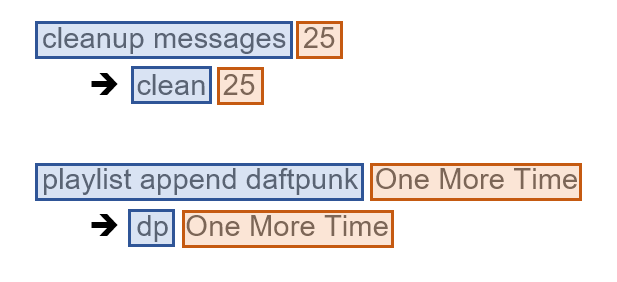
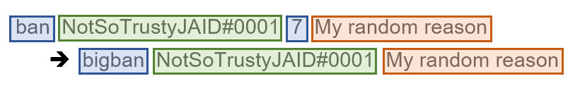

.. _alias:

=====
Alias
=====

This is the cog guide for the alias cog. You will
find detailed docs about the usage and the commands.

``[p]`` is considered as your prefix.

.. note:: To use this cog, load it by typing this::

        [p]load alias

.. _alias-usage:

-----
Usage
-----

This cog is used to create shortcuts for commands.

You can do things like this:

.. code-block:: none

    [p]cleanup messages 42
    equals to
    [p]clean 42

or even this:

.. code-block:: none

    [p]search sc Au temps en emporte le Z event
    equals to
    [p]soundcloud Au temps en emporte le Z event

In the first example, we made an alias named ``clean`` that will
invoke the ``cleanup messages`` command.

In the second example, we made an alias called ``soundcloud`` that will
invoke the ``search sc`` command (search a song to play on SoundCloud). As you
can see, you can also add arguments to your alias. Then you can add the
arguments you want after your alias.

This is the basic usage, where you can define an alias for the first part of
the command and give the second part when invoking the command. A more advanced
usage of aliases is the usage of arguments.

Let's suppose you want to make an alias to ban someone, delete 7 days of
messages and set the reason to "Spam bot.", that cannot be done with a classic
alias since the required member argument is the first one. If you create the
alias "spamban" using arguments like this ``ban {0} 7 Spam bot.``, ``{0}`` will
be replaced by the first argument of your alias:

.. code-block:: none

    [p]ban Slime#3160 7 Spam bot.
    equals to
    [p]spamban Slime#3160

For a more detailed explaination, read :ref:`this <alias-command-alias-add>`.

.. _alias-commands:

--------
Commands
--------

.. _alias-command-alias:

^^^^^
alias
^^^^^

**Syntax**

.. code-block:: none

    [p]alias

**Description**

This is the main command used for setting up the cog.
It will be used for all other commands.

.. _alias-command-alias-add:

"""""""""
alias add
"""""""""

.. note:: |mod-lock|

**Syntax**

.. code-block:: none

    [p]alias add <alias_name> <command>

**Description**

Creates an alias. It will be used like this ``[p]alias_name <arguments>``
and will be equal to this ``[p]command <arguments>``.

Let's develop the examples given :ref:`earlier <alias-usage>` a bit more,
the left part of the command is the alias (blue), and the right part is the
parameters members have to give for the command (orange).

One more thing you can do with aliases is using parameters, a bit like
CustomCommands. Let's suppose you want an alias that bans x member and deletes
7 days of messages. Without aliases, the command would look like this:

``[p]ban NotSoTrustyJAID#0001 7 My random reason``

A classic alias wouldn't work because the member argument is the first one,
and you can only shorten the left part before the required argument.

An alias with arguments can fix that, you can define the alias on the whole
command and replace the required argument by ``{0}``, which will be replaced
by the first argument given when invoking the alias.

Back to our example, let's make an alias named ``bigban`` which will be
assigned to this expression: ``ban {0} 7``

You can see in blue the "static" part of the alias, what is contained and
doesn't need to be given, the orange part is the arguments given at the end of
the command, just like a classic alias, and the green part is the positional
argument we defined: the first argument of the alias will be the green part.

You can add as many arguments as you want, they can start at ``{0}`` or ``{1}``
and must be in order: ``{1}`` will be the first argument, ``{2}`` will be the
second one...

.. attention:: The numbers must be in order, you cannot use ``{0}`` and ``{2}``
    without using ``{1}``.

Here are more examples:

*   *   Full command: ``[p]cleanup messages 75 True``
    *   Alias: ``[p]alias add fullclear cleanup messages {0} True``
    *   Invoked alias: ``[p]fullclear 75``

    *The* ``True`` *at the end tells the bot to also clear pinned messages.*

*   *   Full command: ``[p]repo add SinbadCogs
        https://github.com/mikeshardmind/SinbadCogs v3``
    
    *   Alias: ``[p]alias add newrepo repo add {2} https://github.com/{1}/{2}``
    *   Invoked with alias: ``[p]newrepo mikeshardmind SinbadCogs v3``

**Arguments**

* ``<alias_name>``: The new command name.

* ``<command>``: The command to execute when ``[p]alias_name`` is invoked.

.. _alias-command-alias-delete:

""""""""""""
alias delete
""""""""""""

.. note:: |mod-lock|

**Syntax**

.. code-block:: none

    [p]alias [delete|remove|del] <alias_name>

**Description**

Removes an alias from the list. Check the list with
the :ref:`alias list <alias-command-alias-list>` command.

**Arguments**

* ``<alias_name>``: The alias' name to delete.

.. _alias-command-alias-list:

""""""""""
alias list
""""""""""

**Syntax**

.. code-block:: none

    [p]alias list

**Description**

Shows all of the existing aliases on the current server.

.. _alias-command-alias-show:

""""""""""
alias show
""""""""""

**Syntax**

.. code-block:: none

    [p]alias show <alias_name>

**Description**

Shows the command associated to the alias.

**Arguments**

* ``<alias_name>``: The alias you want information from.

.. _alias-command-alias-help:

""""""""""
alias help
""""""""""

**Syntax**

.. code-block:: none

    [p]alias help <alias_name>

**Description**

Shows help message for an alias.

**Arguments**

* ``<alias_name>``: Alias you want to get help from.

.. _alias-command-alias-global:

""""""""""""
alias global
""""""""""""

.. note:: |owner-lock|

**Syntax**

.. code-block:: none

    [p]alias global

**Description**

Another group command which contains the :ref:`add
<alias-command-alias-add>`, :ref:`del
<alias-command-alias-delete>` and :ref:`list
<alias-command-alias-list>` commands.

They work the same, except the created aliases will be
global instead of being only server-wide.

Please refer to these docs for the commands, they work with the
same arguments. For example, if you want to add a global alias,
instead of doing ``[p]alias add <arguments>``, do ``[p]alias
global add <arguments>``.
