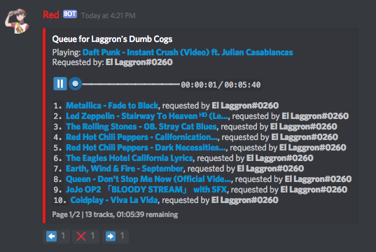
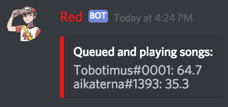

.. _YouTube: https://youtube.com
.. _SoundCloud: https://soundcloud.com
.. _Bandcamp: https://bandcamp.com
.. _Twitch: https://twitch.tv

.. _audio:

=====
Audio
=====

This is the cog guide for the audio cog. You will
find detailled docs about the usage and the commands.

``[p]`` is considered as your prefix.

.. note:: To use this cog, load it by typing this::

        [p]load audio

.. _audio-usage:

-----
Usage
-----

The new audio system has nothing to do with the V2 one.
It's harder, better, faster, stronger. It adds unique
features and it uses Lavalink, a powerful streaming
tool used by Rythm, FredBoat, Dyno and more...

Currently, you can stream using these services:

* YouTube_

* SoundCloud_

* Bandcamp_

* Twitch_

* HTTP URLs

.. * Local files

.. * Website audio output

Here's a quick introduction about how it works.

.. _audio-usage-music:

^^^^^
Music
^^^^^

.. note:: If you use one of the music commands, the bot will
    automatically join your voice channel. You can make it disconnect
    using the :ref:`disconnect <audio-command-disconnect>` command.

You can start listening music with two commands:
:ref:`play <audio-command-play>` and :ref:`search <audio-command-search>`.

The first one will search for the song (YouTube by default) and
play the first result. You can also give a link.

.. tip:: Examples:

    .. code-block:: none

        [p]play harder better faster stronger

    .. code-block:: none

        [p]play https://www.youtube.com/watch?v=GDpmVUEjagg

The second command, :ref:`search <audio-command-search>`, will search
(still on YouTube by default) with the given keywords, then it will
output an interactive message with the search results. You'll just
have to click on the number wanted to start the song.

.. tip:: Example:

    .. code-block:: none

        [p]search dark necessities

    Output:

    .. image:: ../.ressources/audio-search.png

.. _audio-usage-queue-control:

^^^^^^^^^^^^^
Queue control
^^^^^^^^^^^^^

The queue control in Red is very powerful and easy to use. You can use
the :ref:`queue <audio-command-queue>` command to see the current queue.
It will show all of the songs in the queue with an interactive message.
Once you type the command, something like this should be shown:

You can click on the reactions to scroll through pages.

You can skip a song and jump to the next one in the queue using the
:ref:`skip <audio-command-skip>` command. The :ref:`prev <audio-command-prev>`
command goes one song backwards.

If you just added a song to the queue but you want to listen it now,
you can use the :ref:`bump <audio-command-bump>` command that will
move the desired song to the top of the queue.

However, if you want to remove a song from the queue, you can use the
:ref:`remove <audio-command-remove>` command.

Last thing: if you need to shuffle your playlist, you can use the
:ref:`shuffle <audio-command-shuffle>` command that will make Red select
next songs randomly.

.. note:: Using shuffle will disable the :ref:`bump <audio-command-bump>`
    command.

.. tip:: You can make Red show the current song with the
    :ref:`now <audio-command-now>` command. You will also be able to
    skip, prev, play/pause and stop using the reactions.

    You can also make Red send a message in the desired channel when
    a new song is going to be played or if the queue ended. You can set
    that with the :ref:`notify <audio-command-audioset-notify>` command.

.. _audio-usage-stream-control:

^^^^^^^^^^^^^^
Stream control
^^^^^^^^^^^^^^

You can control the music stream how you want. Red allows you to do multiple
actions on the stream.

If you need to pause the stream, use the
:ref:`pause/resume <audio-command-pause>` command.

The volume can be set with the :ref:`volume <audio-command-volume>` command.

You can go forward and backwards in the current track using the
:ref:`seek <audio-command-seek>` command.

.. tip:: Examples:

    To seek ahead on a track by 60 seconds:

    .. code-block:: none

        [p]seek 60

    To seek behind on a track by 30 seconds:

    .. code-block:: none

        [p]seek -30

.. _audio-usage-DJ:

^^^^^^^
DJ Role
^^^^^^^

You can use the :ref:`permissions cog <permissions>` to restrict
commands to a role/channel. However, the cog also provides its own
permission system with the DJ role. If enabled, the members will need
the role to use most of the audio commands (privilege to queue new songs
and manage the queue).

You can set the DJ role using the :ref:`role <audio-command-audioset-role>`
command, then enable it with the :ref:`dj <audio-command-audioset-dj>` command.

.. _audio-commands:

--------
Commands
--------

Since this is a huge cog, the commands are sorted in these hidden
categories:

* Music and main commands

* Queue

* Stream control

* Server settings

* Lavalink

.. _audio-command-play:

^^^^
play
^^^^

.. note:: You need to be in a voice channel to use this command.
    If it is enabled, you also need the :ref:`DJ role <audio-usage-DJ>`

**Syntax**

.. code-block:: none

    [p]play <query>

**Description**

Add a song to the queue. This will get the stream linked to the
URL or search for a song with the given keywords.

If you're providing a URL, these websites are supported:

* YouTube_

* SoundCloud_

* Bandcamp_

* Twitch_

* HTTP URLs

.. * Local files

.. * Website audio output

The bot will fetch the stream associated with the link. However, if no
link is found, the bot will search for the song and get the first result.
The search will be done on YouTube_.

**Arguments**

* ``<query>``: Can be a link or search terms. The link, if found, will be
  streamed. Else, the bot will search wiht the arguments and get the first
  result.

.. _audio-command-search:

^^^^^^
search
^^^^^^

.. note:: You need to be in a voice channel to use this command.
    If it is enabled, you also need the :ref:`DJ role <audio-usage-DJ>`

**Syntax**

.. code-block:: none

    [p]search <query>

**Description**

Search on YouTube_ with the query and returns a list of results with an
interactive message. You can click on the reaction 1/2/3/4/5 to add the song
to the queue. You can also click on the arrows to scroll though the results.

.. tip:: If you want to search on SoundCloud_, you can give ``sc`` before
    your search terms. Example:

    .. code-block:: none

        [p]search sc fade to black metallica

    You can also add **all** results to the queue if you give ``list`` before
    your search terms. Example:

    .. code-block:: none

        [p]search list

.. note:: You can also provide a link, like with the :ref:`play <audio-command-play>`
    command, but this is not the goal of the command.

**Arguments**

* ``<query>``: Can be a link or search terms. The link, if found, will be
  streamed. Else, the bot will search with the arguments and ask your choice.

.. _audio-command-stop:

^^^^
stop
^^^^

.. note:: You need to be in a voice channel to use this command.
    If it is enabled, you also need the :ref:`DJ role <audio-usage-DJ>`

**Syntax**

.. code-block:: none

    [p][stop|s]

**Description**

Stop the current song in the voice channel. However, this won't disconnect
the bot from it. For that, use the :ref:`disconnect <audio-command-disconnect>`
command.

.. warning:: This action will clear the queue.

.. _audio-command-disconnect:

^^^^^^^^^^
disconnect
^^^^^^^^^^

.. note:: You need to be in a voice channel to use this command.
    If it is enabled, you also need the :ref:`DJ role <audio-usage-DJ>`

**Syntax**

.. code-block:: none

    [p][disconnect|dc]

**Description**

Disconnect from the voice channel on the current guild.

.. _audio-command-playlist:

^^^^^^^^
playlist
^^^^^^^^

**Syntax**

.. code-block:: none

    [p]playlist

**Description**

Group command used for the playlist management.

.. _audio-command-playlist-create:

"""""""""""""""
playlist create
"""""""""""""""

**Syntax**

.. code-block:: none

    [p]playlist create <playlist_name>

**Description**

Creates a new empty playlist.

**Arguments**

* ``<playlist_name>``: The playlist's name.

.. _audio-command-playlist-save:

"""""""""""""
playlist save
"""""""""""""

**Syntax**

.. code-block:: none

    [p]playlist save <playlist_name> <playlist_url>

**Description**

Saves a new playlist from a playlist URL. This won't save tracks already
played, only the current and incoming tracks.

.. warning:: This won't **append** the songs to an existing playlist, it
    will **create** a new one.

.. _audio-command-playlist-upload:

"""""""""""""""
playlist upload
"""""""""""""""

**Syntax**

.. code-block:: none

    [p]playlist upload

**Description**

Creates a new playlist from the Red V2 audio data. I'll show you how
to proceed:

#. Find your V2 Redbot folder. This should look like this:

  .. image:: ../.ressources/redv2-files.png

#. Let's suppose you want to convert your playlist named ``transitor``.

  Follow this path ``data/audio/playlist`` and then find ``transitor.txt``.

  .. image:: ../.ressources/path-to-playlist-v2.png

  Keep the file ready for the next step.

#. Type the command ``[p]playlist upload``.

  Upload the ``transitor.txt`` file to Discord, in the channel where you typed
  the command.

The playlist is now ready for Red V3 Audio!

.. _audio-command-playlist-queue:

""""""""""""""
playlist queue
""""""""""""""

**Syntax**

.. code-block:: none

    [p]playlist queue [playlist name]

**Description**

Creates a new playlist from the current queue.

.. warning:: This won't **append** the songs to an existing playlist, it
    will **create** a new one.

.. _audio-command-playlist-delete:

"""""""""""""""
playlist delete
"""""""""""""""

**Syntax**

.. code-block:: none

    [p]playlist delete <playlist_name>

**Description**

Remove a playlist from the bot. You need to be its author to
do this.

**Arguments**

* ``<playlist_name>``: The name of the playlist to remove.

.. _audio-command-playlist-append:

"""""""""""""""
playlist append
"""""""""""""""

.. note:: You need to be in a voice channel to use this command.

**Syntax**

.. code-block:: none

    [p]playlist append <playlist_name> [url...]

**Description**

Add a track to the desired playlist. The search of the song is
similar to the :ref:`play <audio-command-play>` command; you can
provide a URL or search terms, the first result will be retrieved.

**Arguments**

* ``<playlist_name>``: The playlist you want to extend.

* ``[url..]``: An URL or search terms. The song linked will be added
  to the playlist.

.. _audio-command-playlist-remove:

"""""""""""""""
playlist remove
"""""""""""""""

**Syntax**

.. code-block:: none

    [p]playlist remove <playlist_name> <url>

**Description**

Remove a track from a playlist using its URL. You need to be its
author to do this.

**Arguments**

* ``<playlist_name>``: The playlist you want to edit.

* ``<url>``: The URL of the song you want to remove. You may want to
  use the :ref:`playlist info <audio-command-playlist-info>` command
  to get the links.

.. _audio-command-playlist-info:

"""""""""""""
playlist info
"""""""""""""

**Syntax**

.. code-block:: none

    [p]playlist info <playlist_name>

**Description**

Get info from a playlist, such as his author and its songs with their URL.

**Arguments**

* ``<playlist_name>``: The name of the playlist to get the info from.

.. _audio-command-playlist-list:

"""""""""""""
playlist list
"""""""""""""

**Syntax**

.. code-block:: none

    [p]playlist list

**Description**

List all of the created playlists on this guild.

.. _audio-command-queue:

^^^^^
queue
^^^^^

**Syntax**

.. code-block:: none

    [p][queue|q] [page=1]

**Description**

Show the current song with the incoming songs.

You can use the reactions to scroll through the queue. You will also be able to
see who added which song, the number of tracks in the queue and the time
remaining before the queue ends.

**Arguments**

* ``[page=1]``: Specify the page you want to go to. Default to 1.

.. _audio-command-skip:

^^^^
skip
^^^^

.. note:: You need to be in a voice channel to use this command.
    If it is enabled, you also need the :ref:`DJ role <audio-usage-DJ>`

**Syntax**

.. code-block:: none

    [p][skip|forceskip|fs]

**Description**

Skip the current track and jump to the next one in the queue.

.. note:: You can restrict that command with a vote, so Red will only skip
    the track if a percent of users in the voice channel type the skip
    command.

    For example, if you set the percent to 50% and 6 users are in the voice
    channel, 3 users will need to type the skip command. This will not apply
    on mods and admins.

    You can set this with the :ref:`vote <audio-command-audioset-vote>` command.

.. _audio-command-prev:

^^^^
prev
^^^^

.. note:: You need to be in a voice channel to use this command.
    If it is enabled, you also need the :ref:`DJ role <audio-usage-DJ>`

**Syntax**

.. code-block:: none

    [p]prev

**Description**

Same as :ref:`skip <audio-command-skip>`, except it goes forward.

Let's suppose you have this queue running:

* Track 1

* Track 2

* **Track 3 (currently running)**

* Track 4

If you use the :ref:`skip <audio-command-skip>` command,
the track 5 will start. If you use the :ref:`prev <audio-command-prev>`
command, the track 3 will start.

.. _audio-command-bump:

^^^^
bump
^^^^

.. note:: You need to be in a voice channel to use this command.
    If it is enabled, you also need the :ref:`DJ role <audio-usage-DJ>`

**Syntax**

.. code-block:: none

    [p]bump <index>

**Description**

Move a track to the top of the queue. You need to provide the index
of the queue to make this work, get it with the
:ref:`queue <audio-command-queue>` command.

For example, if you just added a song to the queue and it's at the #12 position
in the queue, type ``[p]bump 12`` and it will be now at the #1 position.
You may want to use :ref:`skip <audio-command-skip>` if you want to listen to
it now.

**Arguments**

* ``<index>``: The number of the track in the queue to move.

.. _audio-command-remove:

^^^^^^
remove
^^^^^^

.. note:: You need to be in a voice channel to use this command.
    If it is enabled, you also need the :ref:`DJ role <audio-usage-DJ>`

**Syntax**

.. code-block:: none

    [p]remove <index>

**Description**

Remove a track from the queue. You need to provide the index of the queue
to make this work, get it with the :ref:`queue <audio-command-queue>` command.

For example, if you just added a song to the queue and it's at the #12 position
in the queue, type ``[p]remove 12`` and it will be removed from the queue.

**Arguments**

* ``<index>``: The number of the track in the queue to remove.

.. _audio-command-shuffle:

^^^^^^^
shuffle
^^^^^^^

.. note:: You need to be in a voice channel to use this command.
    If it is enabled, you also need the :ref:`DJ role <audio-usage-DJ>`

**Syntax**

.. code-block:: none

    [p]shuffle

**Description**

Toogle the shuffle of the queue. If it's enabled, the tracks won't be played in
order. Type the command again to disable it.

.. _audio-command-percent:

^^^^^^^
percent
^^^^^^^

**Syntax**

.. code-block:: none

    [p]percent

**Description**

Show the percentage of the queue. Every user who added a song to the queue will
be listed, with the percentage of its queued songs. 

For example, if aikaterna#1393 adds 6 songs to the queue and Tobotimus#0001 adds
11 songs, this is what will be shown:

.. _audio-command-now:

^^^
now
^^^

**Syntax**

.. code-block:: none

    [p][now|np]

**Description**

Shows the current track being played, with the time code and the requester.

There will also be reactions. You can click on them to
:ref:`go back <audio-command-prev>`, :ref:`stop <audio-command-stop>`,
:ref:`pause <audio-command-pause>` or :ref:`skip <audio-command-skip>`.
Each action is equal to its command.

.. _audio-command-pause:

^^^^^^^^^^^^
pause/resume
^^^^^^^^^^^^

.. note:: You need to be in a voice channel to use this command.
    If it is enabled, you also need the :ref:`DJ role <audio-usage-DJ>`

**Syntax**

.. code-block:: none

    [p][pause|resume]

**Description**

Pause or resume the current track.

.. _audio-command-volume:

^^^^^^
volume
^^^^^^

.. note:: You need to be in a voice channel to use this command.
    If it is enabled, you also need the :ref:`DJ role <audio-usage-DJ>`

**Syntax**

.. code-block:: none

    [p]volume [vol]

**Description**

Sets the volume of the stream. The number should be a percent between 1 and 150.
If the number isn't given, the current volume level will be shown.

**Arguments**

* ``[vol]``: The percent of the volume. If not given, the current one will be
  shown.

.. _audio-command-seek:

^^^^
seek
^^^^

.. note:: You need to be in a voice channel to use this command.
    If it is enabled, you also need the :ref:`DJ role <audio-usage-DJ>`

**Syntax**

.. code-block:: none

    [p]seek [seconds=30]

**Description**

Go forward or backward on a track by seconds.

For example, if you want to seek ahead on your track by 100 seconds, type
``[p]seek 100``. If you want to seek behind by 20 seconds, type
``[p]seek -20``.

**Arguments**

* ``[seconds=30]``: The number of seconds to seek; this can be negative.
  Defaults to 30.

.. _audio-command-audiostats:

^^^^^^^^^^
audiostats
^^^^^^^^^^

**Syntax**

.. code-block:: none

    [p]audiostats

**Description**

Shows a list of guilds where the bot is connected on a voice channel.

.. _audio-command-audioset:

^^^^^^^^
audioset
^^^^^^^^

**Syntax**

.. code-block:: none

    [p]audioset

**Description**

Group command used for cog settings.

.. _audio-command-audioset-settings:

"""""""""""""""""
audioset settings
"""""""""""""""""

**Syntax**

.. code-block:: none

    [p]audioset settings

**Description**

Shows the current audio settings on this guild.

.. _audio-command-audioset-status:

"""""""""""""""
audioset status
"""""""""""""""

.. note:: |owner-lock|

**Syntax**

.. code-block:: none

    [p]audioset status

**Description**

Enable the song's title as status. If this is enabled, the bot
will show this status, when a streaming is active.

``Listening to <song_title>``

Type the command again to disable this.

.. _audio-command-audioset-role:

"""""""""""""
audioset role
"""""""""""""

.. note:: |admin-lock|

**Syntax**

.. code-block:: none

    [p]audioset role <role_name>

**Description**

Sets the DJ role. If enabled, only users who have this role will be able
to queue songs. For more informations, check the :ref:`DJ role section
<audio-usage-DJ>`.

.. note:: Don't forget to enable the DJ role with the
    :ref:`dj <audio-command-audioset-dj>` command.

**Arguments**

* ``<role_name>``: The role to add. Please give
  **the exact role name or ID**, or it won't be detected.

.. _audio-command-audioset-dj:

"""""""""""
audioset dj
"""""""""""

.. note:: |admin-lock|

**Syntax**

.. code-block:: none

    [p]audioset dj

**Description**

Enable or disable the DJ role. If enabled, only users who have this
role will be able to queue songs. For more informations, check the
:ref:`DJ role section <audio-usage-DJ>`.

.. _audio-command-audioset-vote:

"""""""""""""
audioset vote
"""""""""""""

.. note:: |mod-lock|

**Syntax**

.. code-block:: none

    [p]audioset vote <percent>

**Description**

Percentage needed to skip a track.

Example: if 10 users are in a voice channel, listening to Red and someone
wants to skip (with a percent vote of 50%), 5 users will need to type the
:ref:`skip <audio-command-skip>` command to skip the track.

Give 0 to disable. This restriction doesn't apply on :ref:`moderators
<getting-started-permissions>`.

.. _audio-command-audioset-notify:

"""""""""""""""
audioset notify
"""""""""""""""

.. note:: |mod-lock|

**Syntax**

.. code-block:: none

    [p]audioset notify

**Description**

Toogle the new songs notifications. If enabled, when a new song is starting,
a message will be sent in the channel. It will also send a notification when
the queue has ended.

.. note:: The channel where the notifications will be sent is the channel
    where the audio was initialized (the command who made the bot join).

.. _audio-command-audioset-jukebox:

""""""""""""""""
audioset jukebox
""""""""""""""""

.. note:: |mod-lock|

**Syntax**

.. code-block:: none

    [p]audioset jukebox <price>

**Description**

Sets a price for queuing songs. This interacts with the bank.
Set 0 to disable

**Arguments**

* ``<price>``: The price for queuing a new song.
