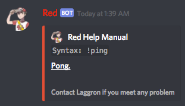
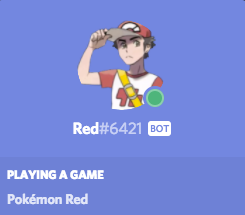
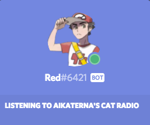
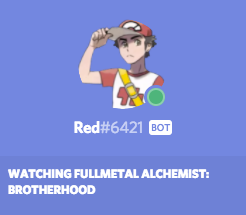
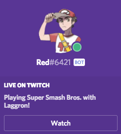
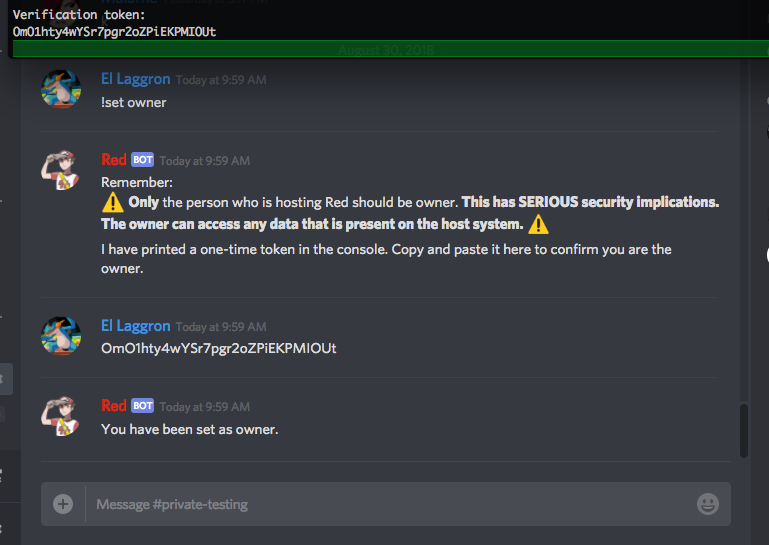
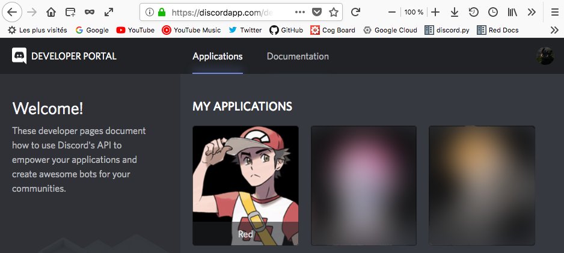
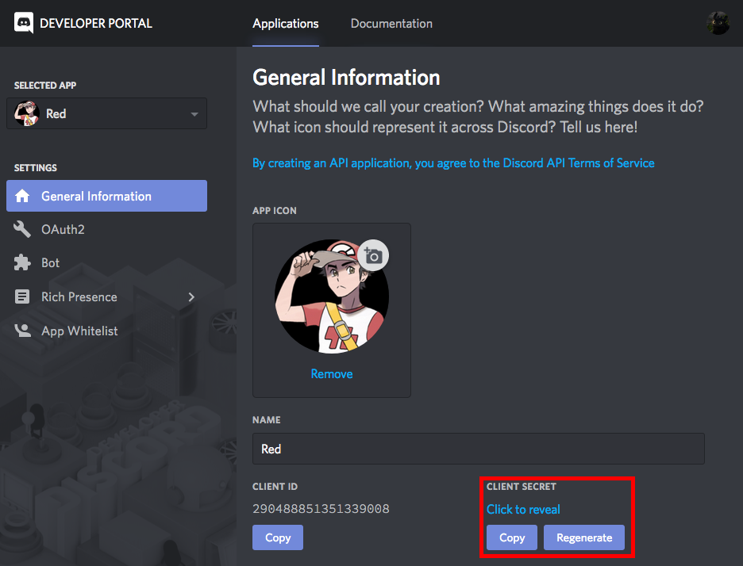
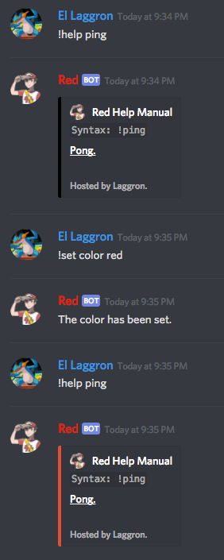

.. _core:

====
Core
====

This is the cog guide for the core cog. You will
find detailed docs about usage and commands.

``[p]`` is considered as your prefix.

.. note:: This cog is not like the other cogs. It is loaded by default, not
    included in the cogs paths and it cannot be unloaded. It contains the
    core commands necessary for Red.

.. _core-usage:

-----
Usage
-----

The Core cog is the base of Red. It contains the essential functions, such
as managing the cogs, restart the bot, leave servers, set the locale...

The cog cannot be unloaded, but most of the commands are made for the
:ref:`bot owner <getting-started-permissions>` and won't be seen by the
other users in the help command.

.. _core-commands:

--------
Commands
--------

Since this is a huge cog, the commands are sorted in these hidden
categories:

* System

* Cog management

* Red settings (include bot user)

* Server and user management

* User commands (not restricted to the bot owner)

.. _core-command-uptime:

^^^^^^
uptime
^^^^^^

.. note:: |owner-lock|

**Syntax**

.. code-block:: none

    [p]uptime

**Description**

Shows for how long the bot is running.

.. _core-command-traceback:

^^^^^^^^^
traceback
^^^^^^^^^

.. note:: |owner-lock|

**Syntax**

.. code-block:: none

    [p]traceback [public=False]

**Description**

Send the full log of the last error that occured when running a command
or loading a cog. Necessary if you need to describe to someone else your
problem.

**Arguments**

*   ``[public=False]``: Defines if the log of the message should be send
    in the context channel or in DM. If you want the message to be posted
    in the channel where you typed the command, specify ``True`` or ``yes``
    for this argument.

.. _core-command-backup:

^^^^^^
backup
^^^^^^

.. note:: |owner-lock|

**Syntax**

.. code-block:: none

    [p]backup [backup_path]

**Description**

Create a backup of the bot's files in a zip file. This function is the same
as the launcher's backup function (when deleting an instance).

**Arguments**

*   ``[backup_path]``: Specify where the zip file will be placed. If not
    specified, the backup will be placed in the base path (where you're
    running the bot).

.. _core-command-restart:

^^^^^^^
restart
^^^^^^^

.. note:: |owner-lock|

**Syntax**

.. code-block:: none

    [p]restart

**Description**

Close the bot's connection to Discord and restart. This will reload all cogs
and the bot's files.

.. _core-command-shutdown:

^^^^^^^^
shutdown
^^^^^^^^

.. note:: |owner-lock|

**Syntax**

.. code-block:: none

    [p]shutdown

**Description**

Disconnect from Discord and close the process safely. To restart, type ``redbot
YourInstance`` in your console.

.. _core-command-load:

^^^^
load
^^^^

.. note:: |owner-lock|

**Syntax**

.. code-block:: none

    [p]load <cog_name>

**Description**

Loads a cog with its commands.

.. The cog must be available in the bot's path. Check :ref:`CogManagerUI` for more
    informations about cog paths.

.. You can list for the loaded and unloaded cogs using the :ref:`cogs
    <CogManagerUI-command-cogs>` command.

.. tip:: You can search for new cogs on `<https://cogs.red/>`_  and install them
    with the :ref:`downloader` cog.

**Arguments**

*   ``<cog_name>``: The name of the cog you want to load.

    .. tip:: You can load multiple cogs at one like this: ``[p]load cog1 cog2 ..``

.. _core-command-reload:

^^^^^^
reload
^^^^^^

.. note:: |owner-lock|

**Syntax**

.. code-block:: none

    [p]reload <cog_name>

**Description**

Unloads and load a cog.

.. The cog must be available in the bot's path. Check :ref:`CogManagerUI` for more
    informations about cog paths.

**Arguments**

*   ``<cog_name>``: The name of the cog you want to reload.

    .. tip:: You can reload multiple cogs at one like this: ``[p]reload cog1 cog2 ..``

.. _core-command-unload:

^^^^^^
unload
^^^^^^

.. note:: |owner-lock|

**Syntax**

.. code-block:: none

    [p]unload <cog_name>

**Description**

Unloads and cog with its commands.

**Arguments**

*   ``<cog_name>``: The name of the cog you want to unload.

    .. tip:: You can unload multiple cogs at one like this: ``[p]unload cog1 cog2 ..``

.. _core-command-listlocales:

^^^^^^^^^^^
listlocales
^^^^^^^^^^^

.. note:: |owner-lock|

**Syntax**

.. code-block:: none

    [p]listlocales

**Description**

List the available translations for the bot in the correct format.

This is used by the :ref:`set locale <core-command-set-locale>` command to
change the bot's language.

.. _core-command-helpset:

^^^^^^^
helpset
^^^^^^^

.. note:: |owner-lock|

**Syntax**

.. code-block:: none

    [p]helpset

**Description**

Group command used for setting up the help message invoked when using ``[p]help``.

.. _core-command-helpset-maxpages:

""""""""""""""""
helpset maxpages
""""""""""""""""

**Syntax**

.. code-block:: none

    [p]helpset maxpages <pages>

**Description**

Sets the maximum number of pages that should be send in a server channel. A
page is an embed (message). If the number of pages that needs to be send exceed
what you set, the help will be send in DM.

.. note:: This setting only applies to embedded help.

**Arguments**

*   ``maxpages``: The maximum number of pages to set.

.. _core-command-helpset-pagecharlimit:

"""""""""""""""""""""
helpset pagecharlimit
"""""""""""""""""""""

**Syntax**

.. code-block:: none

    [p]helpset pagecharlimit <limit>

**Description**

Sets the maximum number of characters to send per page. A page is an embed
(message).

.. note:: This setting only applies to embedded help.

**Arguments**

*   ``<limit>``: The maximum number of characters to set. Must be inferior than
    6000.

.. _core-command-helpset-tagline:

"""""""""""""""
helpset tagline
"""""""""""""""

**Syntax**

.. code-block:: none

    [p]helpset tagline [tagline]

**Description**

Sets the tagline of the help embed. The tagline is the next at the bottom of
the embed.

For example, if you set ``Contact Laggron if you meet any problem``, this is
what will be shown at the bottom of every embed:

.. note:: This setting only applies to embedded help.

**Arguments**

*   ``[tagline]``: The text you want to set. Omit the argument to reset the
    tagline.

.. _core-command-set:

^^^
set
^^^

**Syntax**

.. code-block:: none

    [p]set

**Description**

Group command used for changing Red settings, such as his name, his profile
picture, his status, or some other settings like :ref:`admin and mod roles
<getting-started-permissions>`,
:ref:`the bot owner <getting-started-permissions>`, the prefix, the token...

.. _core-command-set-name:

""""""""
set name
""""""""

.. note:: |owner-lock|

**Syntax**

.. code-block:: none

    [p]set [username|name] <username>

**Description**

Change your bot's name. The user rules also applies on the bot's username (such
as a name limited to 32 characters).

**Arguments**

*   ``<username>``: The new bot's name. Must be inferior or equal to 32
    characters.

.. _core-command-set-nickname:

""""""""""""
set nickname
""""""""""""

.. note:: |admin-lock|

**Syntax**

.. code-block:: none

    [p]set nickname [nickname]

**Description**

Set Red's nickname on the current server. This command doesn't work in DM.

**Arguments**

*   ``[nickname]``: The new bot's nickname. Must be inferior or equal to 32
    characters. If omitted, the nickname will be reset.

.. _core-command-set-avatar:

""""""""""
set avatar
""""""""""

.. note:: |owner-lock|

**Syntax**

.. code-block:: none

    [p]set avatar <url>

**Description**

Change Red's avatar. This needs an URL. The file must be a JPG or a PNG.

.. warning:: Like normal users, you can only change your avatar up to 2
    times per hour.

**Arguments**

*   ``<url>``: The URL of the profile picture. It must be a direct link
    (ends with .png or .jpg).

.. _core-command-set-status:

""""""""""
set status
""""""""""

.. note:: |owner-lock|

**Syntax**

.. code-block:: none

    [p]set status <status>

**Description**

Set your bot's status (online, idle, do not deny, invisible).

.. note:: If you want to set the streaming status, use the
    :ref:`set stream <core-command-set-stream>` command.

**Arguments**

*   ``<status>``: The new status of the bot. It needs to be one of the
    following names:

    *   online
    *   idle
    *   dnd
    *   invisible

.. _core-command-set-game:

""""""""
set game
""""""""

.. note:: |owner-lock|

**Syntax**

.. code-block:: none

    [p]set game [game]

**Description**

Set Red's playing status.

For example, if I type ``[p]set game Pokémon Red``, this is
what will be shown on Discord:

**Arguments**

*   ``[game]``: The status to set. If omitted, the playing status
    will be removed.

.. _core-command-set-listening:

"""""""""""""
set listening
"""""""""""""

.. note:: |owner-lock|

**Syntax**

.. code-block:: none

    [p]set listening [listening]

**Description**

Set Red's listening status (not Spotify, but something custom).

For example, if I type ``[p]set listening aikaterna's cat radio``, this is
what will be shown on Discord:

**Arguments**

*   ``[listening]``: The status to set. If omitted, the listening status
    will be removed.

.. _core-command-set-watching:

""""""""""""
set watching
""""""""""""

.. note:: |owner-lock|

**Syntax**

.. code-block:: none

    [p]set watching [watching]

**Description**

Set Red's watching status.

For example, if I type ``[p]set watching Fullmetal Alchemist: Brotherhood``,
this is what will be shown on Discord:

**Arguments**

*   ``[watching]``: The status to set. If omitted, the watching status
    will be removed.

.. _core-command-set-stream:

""""""""""
set stream
""""""""""

.. note:: |owner-lock|

**Syntax**

.. code-block:: none

    [p]set stream [streamer] [stream_title]

**Description**

Set Red's streaming status. This needs a Twitch streamer to work.

For example, if I type ``[p]set stream kowlin Playing Super Smash Bros. with
Laggron!``, this is what will be sown on Discord:

The ``Watch`` button will redirect you to `Kowlin's Twitch channel
<https://twitch.tv/kowlin>`_.

**Arguments**

*   ``[streamer]``: The name of the streamer's Twitch channel. This is what's
    shown after `<https://twitch.tv/>`_ in your web browser's current link.

*   ``[stream_title]``: The status to set after ``Playing``.

If both arguments are omitted, the bot's status will be removed.

.. _core-command-set-owner:

"""""""""
set owner
"""""""""

**Syntax**

.. code-block:: none

    [p]set owner

**Description**

Set a new bot owner. This command can be used by everyone, but you
need to confirm you're its owner.

When the command is invoked, a special token will be printed in the
console. You will need to paste this token in the Discord chat to
confirm you're the owner.

Example:

.. note:: This cannot be used if you passed the ``--no-prompt`` flag
    to Red when starting.

.. _core-command-set-token:

"""""""""
set token
"""""""""

.. note:: |owner-lock|

**Syntax**

.. code-block:: none

    [p]set token <token>

**Description**

Change the bot's token. After changing it, you will need to restart
the bot to make it connect to the new token.

**How to find your application token**

Go on the `Discord developer portal <https://discordapp.com/developers>`_
and find your application. If you don't have any applications, create one.

Click on your application, and find ``Client secret``. You can click on
``Click to reveal`` to reveal your token and copy it, or just click on
``Copy`` to copy to the clipboard.

.. warning:: This token is absolutely **secret**. Do not reveal this to
    anyone. Leaking your token is like revealing your password to everyone.
    If someone have your bot's token, he will be able to do everything he
    want through him, that's why the usage of this command in DM is disabled.

    If you think your token got leaked, click on the ``Regenerate`` button
    shown above and stay safe.

**Arguments**

*   ``<token>``: The key given by the developer portal.

.. _core-command-set-prefix:

""""""""""
set prefix
""""""""""

.. note:: |owner-lock|

**Syntax**

.. code-block:: none

    [p]set [prefix|prefixes] [prefixes...]

**Description**

Changes the bot's prefix. You can have multiple prefixes, or
insert spaces in it.

.. note:: To make the mention one of the bot's prefix, just add the
    ``--mentionable`` to ``redbot`` when starting the bot.

.. warning:: Setting a global prefix will **delete** the previous ones.
    Server specific prefixes **overwrites** the global ones.

**Examples**

*   ``[p]set prefix !``: The prefix is now ``!``.

    *   ``!ping``

*   ``[p]set prefix "Red plz, "``: The prefix is now "Red pls, ".

    *   ``Red plz, ping``

*   ``[p]set prefixes ? >> "blue "``: There are now 3 prefixes: "?", ">>"
    and "blue ".

    *   ``?ping``
    *   ``>>ping``
    *   ``blue ping``

**Arguments**

*   ``[prefixes...]``: A list of prefixes to set for the bot.

.. _core-command-set-serverprefix:

""""""""""""""""
set serverprefix
""""""""""""""""

.. note:: |admin-lock|

**Syntax**

.. code-block:: none

    [p]set [serverprefix|serverprefixes] [prefixes...]

**Description**

Changes the bot's prefix for the current guild only. The usage is similar to
the :ref:`set prefix <core-command-set-prefix>` command.

.. warning:: Setting a server prefix will overwrites the default ones.

.. tip:: Invoke the command without arguments to remove the serverprefixes and
    use the global ones instead.

**Arguments**

*   ``[prefixes...]``: A list of prefixes to set for the server. Omit this
    argument to reset them.

.. _core-command-set-color:

"""""""""
set color
"""""""""

.. note:: |owner-lock|

**Syntax**

.. code-block:: none

    [p]set [colour|color] [colour]

**Description**

Change Red's embed color. The bot will use this color for most of the embeds.

Example:

**Arguments**

*   ``[colour]``: The color of the embed to set. If omitted, the default color
    will be set (red).

    You can set an hexadecimal code like this: ``#<hex>`` / ``0x<hex>`` or
    provide one of the default colors. `List of the color availables
    <https://discordpy.readthedocs.io/en/rewrite/api.html#discord.Colour.default>`_

.. _core-command-set-usebotcolour:

""""""""""""""""
set usebotcolour
""""""""""""""""

.. note:: |guildowner-lock|

**Syntax**

.. code-block:: none

    [p]set [usebotcolour|usebotcolor]

**Description**

Defines if the bot should use the bot's default color for the embeds (set by
:ref:`color <core-command-set-color>`) or use its own for the server, which
will be the bot's top role color, to match with its chat color.

.. _core-command-set-locale:

""""""""""
set locale
""""""""""

.. note:: |owner-lock|

**Syntax**

.. code-block:: none

    [p]set locale <locale_name>

**Description**

Modify the bot's language using one of the available translations.

You can get the list of available translations by using the
:ref:`listlocales <core-command-listlocales>` command.

.. note:: This does not modify the command's names.

If your language isn't available or have missing translations, help us
translating the bot by joining our `Crowdin project
<https://crowdin.com/project/red-discordbot>`_ !

**Arguments**

*   ``<locale_name>``: The new language to set. It usually looks like this:
    ``fr-FR``/``en-ES``.

    .. tip:: Reset the bot to its default language by typing
        ``[p]set locale en-US``, whatever the current language is.

.. _core-command-set-fuzzy:

"""""""""
set fuzzy
"""""""""

.. note:: |admin-lock|

**Syntax**

.. code-block:: none

    [p]set fuzzy

**Description**

Enables or disables fuzzy search in private message. Default is disabled.

Fuzzy search gives you some command suggestions if you made a typo in your
command name.

Example:

.. image:: ../.ressources/fuzzy-search.png

.. _core-command-set-serverfuzzy:

"""""""""""""""
set serverfuzzy
"""""""""""""""

.. note:: |guildowner-lock|

**Syntax**

.. code-block:: none

    [p]set serverfuzzy

**Description**

Enables or disables fuzzy search in your server. Default is disabled.

See :ref:`fuzzy <core-command-set-fuzzy>` for more informations about
fuzzy search.

.. _core-command-set-adminrole:

"""""""""""""
set adminrole
"""""""""""""

.. note:: |guildowner-lock|

**Syntax**

.. code-block:: none

    [p]set adminrole <role>

**Description**

Sets the admin role for the current server.

The admin role will define a default permissions model for the server, which
means that members with this role will be able to use admin commands.

For more informations about Red's default permission model, please read
:ref:`getting started with permissions <getting-started-permissions>`.

.. warning:: Members with this role will have a lot of permissions, including
    banning members. **This is a dangerous role to set**, don't give that to
    members you don't fully trust.

.. _core-command-set-modrole:

"""""""""""
set modrole
"""""""""""

.. note:: |guildowner-lock|

**Syntax**

.. code-block:: none

    [p]set modrole <role>

**Description**

Sets the mod role for the current server.

The mod role will define a default permissions model for the server, which
means that members with this role will be able to use moderation commands.

For more informations about Red's default permission model, please read
:ref:`getting started with permissions <getting-started-permissions>`.

.. warning:: Members with this role will have a lot of permissions, including
    banning members. **This is a dangerous role to set**, don't give that to
    members you don't fully trust.

.. _core-command-set-sentry:

""""""""""
set sentry
""""""""""

.. note:: |owner-lock|

**Syntax**

.. code-block:: none

    [p]set sentry <on_or_off>

**Description**

Enables or disables Red Sentry logging.

Sentry is the system Red uses to manage error reporting. This means that all
of the errors you get will be reported and logged for the core developers so
they can fix bugs.

This was originally set up when creating your Red instance.

This should not be enabled if you made your own modidications to the bot (for
a pull request) or if you use it for testing on cog creation.

More informations about Sentry can be found `there <https://sentry.io/>`_.

.. note:: You can pass the ``--sentry`` flag to force Sentry activation, which
    overwrites what was set before. You can also pass ``--no-sentry`` to do
    the opposite.

Sentry status can be checked on the bot's console, first line in the right box.

.. image:: ../.ressources/red-console.png

.. _core-command-servers:

^^^^^^^
servers
^^^^^^^

.. note:: |owner-lock|

**Syntax**

.. code-block:: none

    [p]servers

**Description**

List all of the servers the bot is on. This also allows you to make the bot
leave a server.

If you want to do so, type the command once, find the server and type its
number in the chat. Then the bot will leave that server.

.. _core-command-leave:

^^^^^
leave
^^^^^

.. note:: |owner-lock|

**Syntax**

.. code-block:: none

    [p]leave

**Description**

Leave the server where the message was typed. You will need to confirm by
typing ``yes`` in the chat.

.. note:: Data of the server is still stored and ready if the bot comes back.

.. _core-command-invite:

^^^^^^
invite
^^^^^^

.. note:: |owner-lock|

**Syntax**

.. code-block:: none

    [p]invite

**Description**

Send you the bot's invite URL in private message.

.. tip:: You can use the `Discord permissions calculator <https://discordapi.com/permissions.html>`_
    for generating your own invite link, with a redirect URI and a permissions
    model (this is how you create a special role for the bot).

    Set ``scope`` to ``bot``, ``Require Code Grant`` must stay unticked and
    you need to paste the bot's ID in ``Client ID``. Get your bot's ID with
.. the :ref:`userinfo <mod-command-userinfo>` command.

.. _core-command-blacklist:

^^^^^^^^^
blacklist
^^^^^^^^^

.. note:: |owner-lock|

**Syntax**

.. code-block:: none

    [p]blacklist

**Description**

Manage the global list of users who are banned from the bot. Any user in that
list will be completly ignored by all commands and listeners.

This applies on **all** servers and in private message.

.. important:: The blacklist/whitelist management is the same for all types.
    The description for this group command will be the same for the others.

.. _core-command-blacklist-add:

"""""""""""""
blacklist add
"""""""""""""

**Syntax**

.. code-block:: none

    [p]blacklist add <user>

**Description**

Add a user to the blacklist. He will be completly ignored by the bot, for
commands, messages, reactions and other types of listeners.

**Arguments**

*   ``<user>``: The user to add to the blacklist.

.. _core-command-blacklist-remove:

""""""""""""""""
blacklist remove
""""""""""""""""

**Syntax**

.. code-block:: none

    [p]blacklist add <user>

**Description**

Remove a user from the blacklist. He won't be ignored anymore by the bot.

**Arguments**

*   ``<user>``: The user to add to the blacklist.

.. _core-command-blacklist-list:

""""""""""""""
blacklist list
""""""""""""""

**Syntax**

.. code-block:: none

    [p]blacklist list

**Description**

List all of the blackliste users on the bot.

.. _core-command-blacklist-clear:

"""""""""""""""
blacklist clear
"""""""""""""""

**Syntax**

.. code-block:: none

    [p]blacklist clear

**Description**

Completly clear the blacklist by removing all users registered.

.. warning:: This action cannot be reversed.

.. _core-command-whitelist:

^^^^^^^^^
whitelist
^^^^^^^^^

.. note:: |owner-lock|

**Syntax**

.. code-block:: none

    [p]whitelist

**Description**

Manage the global list of users who are allowed to use the bot.

.. warning:: Everyone have access to the bot by default. If you add one user
    user to that list, everyone else will be automatically "blacklisted" and
    you will have to whitelist users that should have access to the bot.

This applies on **all** servers and in private message.

For more informations about this group command's subcommands, please take a
look at the :ref:`blacklist <core-command-blacklist>` command, since the
subcommands are the same.

.. _core-command-localblacklist:

^^^^^^^^^^^^^^
localblacklist
^^^^^^^^^^^^^^

.. note:: |admin-lock| It will also work if you have the ``Administrator``
    permission.

**Syntax**

.. code-block:: none

    [p]localblacklist

**Description**

Manage the server list of users who are banned from the bot. Any user in that
list will be completly ignored by all commands and listeners.

This only applies on your server.

For more informations about this group command's subcommands, please take a
look at the :ref:`blacklist <core-command-blacklist>` command, since the
subcommands are the same.

.. _core-command-localwhitelist:

^^^^^^^^^^^^^^
localblacklist
^^^^^^^^^^^^^^

.. note:: |admin-lock| It will also work if you have the ``Administrator``
    permission.

**Syntax**

.. code-block:: none

    [p]localblacklist

**Description**

Manage the global list of users who are allowed to use the bot.

.. warning:: Everyone have access to the bot by default. If you add one user
    user to that list, everyone else will be automatically "blacklisted" and
    you will have to whitelist users that should have access to the bot.

This only applies on your server.

For more informations about this group command's subcommands, please take a
look at the :ref:`blacklist <core-command-blacklist>` command, since the
subcommands are the same.

**Arguments**

*   ``<on_or_off>``: ``on`` if you want to enable Sentry, else ``off``.

.. _core-command-command:

^^^^^^^
command
^^^^^^^

**Syntax**

.. code-block:: none

    [p]command

**Description**

Disable or enable commands.

.. _core-command-command-disable:

"""""""""""""""
command disable
"""""""""""""""

.. note:: This command can be locked to the
    :ref:`bot owner <getting-started-permissions>` or the :ref:`server owner
    <getting-started-permissions>`, depending on what you're doing.

**Syntax**

.. code-block:: none

    [p]command disable <command>

**Description**

Disable a command on all servers. This will affect everyone, including the bot
owner, unlike :ref:`permissions`.

This command has two subcommmands: ``global`` and ``server``. If you use ``[p]
command disable server``, you will disable the command in the current server
only. ``[p]command disable global`` will disable the command globally.

Using ``[p]command disable`` without a subcommand will be default to a global
disable if you're the bot owner, else on the current server.

**Arguments**

*   ``<command>``: The command to disable. The cog of the command must be
    loaded.

.. _core-command-command-enable:

"""""""""""""""
command enable
"""""""""""""""

.. note:: This command can be locked to the
    :ref:`bot owner <getting-started-permissions>` or the :ref:`server owner
    <getting-started-permissions>`, depending on what you're doing.

**Syntax**

.. code-block:: none

    [p]command enable <command>

**Description**

Enable a command that was previously disabled.

The subcommands works the same as for the :ref:`command disable
<core-command-command-disable>` command.

**Arguments**

*   ``<command>``: The command to enable. The cog of the command must
    be loaded.

.. _core-command-command-disablemdg:

""""""""""""""""""
command disablemsg
""""""""""""""""""

.. note:: |owner-lock|

**Syntax**

.. code-block:: none

    [p]command disabledmsg [message]

**Description**

Modify the message posted when a disabed command is used. You can remove that
message by using the command without argument.

.. tip:: You can place ``{command}`` in your message to represent the command
    that was invoked.

**Arguments**

*   ``[message]``: The message to post. Omit this to remove the message.

.. _core-command-embedset:

^^^^^^^^
embedset
^^^^^^^^

**Syntax**

.. code-block:: none

    [p]embedset

**Description**

Group command used for setting up the embed system. You can enable or disable
the embed usage for some commands, like help.

This setting can be global, server-wide or user-only.

.. _core-command-embedset-global:

"""""""""""""""
embedset global
"""""""""""""""

.. note:: |owner-lock|

**Syntax**

.. code-block:: none

    [p]embedset global [enabled]

**Description**

Enable or disable the usage of embeds with compatible commands. The setting
will be global and applied on everyone by default, but it can be modified for
specific servers/users.

**Arguments**

*   ``[enabled]``: If specified, the embeds will be enabled, else they will
    be disabled.

.. _core-command-embedset-guild:

""""""""""""""
embedset guild
""""""""""""""

.. note:: |guildowner-lock| It will also work if you have the ``Administrator``
    permission.

**Syntax**

.. code-block:: none

    [p]embedset guild [enabled]

**Description**

Enable or disable the usage of embeds with compatible commands. The setting
will be server-wide and applied in the server, but it can be modified for
specific users.

**Arguments**

*   ``[enabled]``: If specified, the embeds will be enabled, else they will
    be disabled.

.. _core-command-embedset-user:

"""""""""""""
embedset user
"""""""""""""

**Syntax**

.. code-block:: none

    [p]embedset user [enabled]

**Description**

Enable or disable the usage of embeds with compatible commands. The setting
will only be applied with you.

**Arguments**

*   ``[enabled]``: If specified, the embeds will be enabled, else they will
    be disabled.

.. _core-command-dm:

^^
dm
^^

.. note:: |owner-lock|

**Syntax**

.. code-block:: none

    [p]dm <user_id> <message>

**Description**

Send a message to a user through the bot. **This needs a user ID to work**.

To get a user ID, enable "Developer mode" in Discord's settings, "Appearance"
tab. Then you can right-click on a user and copy its ID by clicking "Copy ID".

**Arguments**

*   ``<user_id>``: The ID of the user. This cannot be a mention or a name.

*   ``<message>``: The message you want to send to that user.

.. _core-command-contact:

^^^^^^^
contact
^^^^^^^

**Syntax**

.. code-block:: none

    [p]contact <message>

**Description**

Send a message to the owner of the bot. He can answer you through the bot.

**Arguments**

*   ``<message>``: The message you want to send.

.. _core-command-info:

^^^^
info
^^^^

**Syntax**

.. code-block:: none

    [p]info

**Description**

Shows general informations about the bot.

This will show the owner of the bot, the version of Python and discord.py, and
Red-DiscordBot's version. If Red is outdated, the message will tell the user
that the bot is not under the latest version and version x is available.

This also shows some informations about Red, its author, Twentysix, and its
community.

.. attention:: This command is the main source of credits for their creators.
    The only thing we ask if you use Red is to do not try to remove the
    credits, as a respect for those who made Red.
