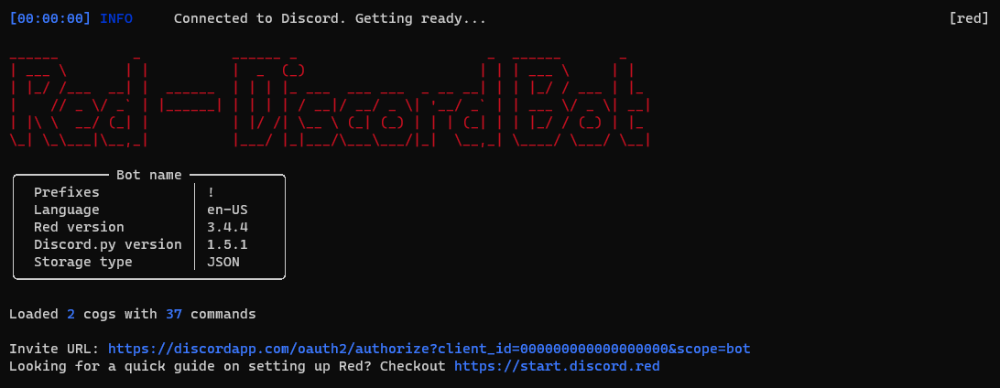

.. don't forget to set permissions hyperlink
  + commands links + guide links

.. _getting-started:

===============
Getting started
===============

If you recently installed Red, you should read this.
This is a quick start guide for a general usage.

.. note::

    If you haven't installed Red, please do it by following
    the :ref:`installation guides <main>`.

Assuming you correctly installed Red, you should have a
window like this:

.. _gettings-started-invite:

-------------------------
Invite Red to your server
-------------------------

When started, the console will show you ``Invite URL`` (here at
the bottom of the screenshot).
Paste the link into your browser and select the server you want
to invite the bot in, like any other bot.

.. note:: You need the ``Manage server`` permission to add bots.

Complete the captcha, it should tell you ``Authorized!`` and you
should see your bot in the members list.

.. attention::
    If Discord shows ``Bot requires code grant``, please untick this
    option in your token settings

    .. image:: .resources/code-grant.png

.. _getting-started-interact:

-----------------
Interact with Red
-----------------

As a chatbot, you interact with Red via the Discord text channels
(not from the command prompt). For that, you will use the prefix you
set before. For example, if your prefix is ``!``, you will execute your
command like this: ``!ping``.

.. note:: Since the prefix can be anything, it'll be referenced as ``[p]``
    in documentations.

.. _getting-started-commands:

~~~~~~~~~~~~
The commands
~~~~~~~~~~~~

The command you're going to use the most is help. That command will
show you **all of the available commands** of the bot with a small description.

.. code-block:: none

    [p]help

.. tip:: The message is generated dynamically and users will only see the
    commands they can use. You can change what commands users can use with the
    permissions cog.

You can also pick a command to get its detailed description and the
parameters.

.. code-block:: none

    [p]help command

The parameters are shown as enclosed in ``< >`` if they're needed, or
``[ ]`` if optional.
As an example, the ban command will show this in the help message:
``Syntax: !ban <user> [days] [reason]``

This means that it is necessary to provide ``user``. However, the
``days`` value (number of messages to delete) is optional, like
the ``reason`` value, used for the modlog.

You can use help to show the **categories** too (named cogs).
Just do so (notice the capitalization):

.. code-block:: none

    [p]help YourCategory

Help also shows **command groups**. They are group of commands.
To get the description of a subcommand, type this:

.. code-block:: none

    [p]help commandgroup subcommand

When using subcommands, you also need to specify the command group.
As an example, ``cleanup`` has 6 subcommands. If you want
to use one, do it like this: ``[p]cleanup messages 10``

.. _getting-started-cogs:

----
Cogs
----

Red is built with cogs, fancy term for plugins. They are
modules that enhance the Red functionalities. They contain
commands to use.

Red comes with 19 cogs containing the basic features, such
as moderation, utility, music, streams...

You can see your loaded and unloaded cogs with the ``[p]cogs``
command. By default, all cogs will be unloaded.

You can load or unload a cog by using the load or unload command

.. code-block:: none

    [p]load cogname
    [p]unload cogname

.. tip:: You can load and unload multiple cogs at once:

    .. code-block:: none

        [p]load cog1 cog2 ...

You can enable and disable everything you want, which means you can
customize Red how you want!

.. _getting-started-community-cogs:

~~~~~~~~~~~~~~
Community cogs
~~~~~~~~~~~~~~

There's an entire `community <https://discord.gg/red>`_ that contributes
to Red. Those contributors make additional cogs for you to use. You can
download them using the downloader cog.

You can start using the downloader cog by loading it: ``[p]load downloader``

You can find cogs by searching on ``cogs.red``. Find whatever you want,
there are hundreds of cogs available!

.. note:: ``cogs.red``, the website that list all of the cogs is not
    ready for v3 yet. For now, you can refer to `this post
    <https://cogboard.red/t/approved-repositories/210>`_.

.. 26-cogs not available, let's use my repo :3

Cogs comes with repositories. A repository is a container of cogs
that you can install. Let's suppose you want to install the ``say``
cog from the repository ``Laggrons-Dumb-Cogs``. You'll first need
to install the repository.

.. code-block:: none

    [p]repo add Laggrons-Dumb-Cogs https://github.com/retke/Laggrons-Dumb-Cogs

.. note:: You may need to specify a branch. If so, add its name after the link.

Then you can add the cog

.. code-block:: none

    [p]cog install Laggrons-Dumb-Cogs say

Now the cog is installed, but not loaded. You can load it using the ``[p]load``
command we talked about before.

.. _getting-started-permissions:

-----------
Permissions
-----------

Red works with different levels of permissions. Every cog defines
the level of permission needed for a command.

~~~~~~~~~
Bot owner
~~~~~~~~~

The bot owner can access all commands on every guild. He can also use
exclusive commands that can interact with the global settings
or system files.

*You* are the owner by default. If the owner isn't set, use ``[p]set owner``.

~~~~~~~~~~~~
Server owner
~~~~~~~~~~~~

The server owner can access all commands on his guild, except the global
ones or those who can interact with system files (available for the
bot owner).

~~~~~~~~~~~~~
Administrator
~~~~~~~~~~~~~

The administrator is defined by its roles. You can set multiple admin roles
with the ``[p]addadminrole`` and ``[p]removeadminrole`` commands.

For example, in the mod cog, an admin can use the ``[p]modset`` command
which defines the cog settings.

~~~~~~~~~
Moderator
~~~~~~~~~

A moderator is a step above the average users. You can set multiple moderator
roles with the ``[p]addmodrole`` and ``[p]removemodrole`` commands.

For example, in the mod cog (again), a mod will be able to mute, kick and ban;
but he won't be able to modify the cog settings with the ``[p]modset`` command.

.. tip::
    If you don't like the default permission settings for some commands or
    if want to restrict a cog or a command to a channel/member, you can use
    the permissions cog.

.. _getting-started-hosting:

-------
Hosting
-------

If you are hosting Red on your personal computer, you will soon notice that
if you close the window or if you shut down you computer, Red will be offline.
She needs an environment to work and respond.

You can try to host Red somewhere he will always be online, like on a virtual
private server (VPS) or on a personal server (e.g. Raspberry Pi).

If you want to do it, follow these steps.

.. warning::
    Before trying to host Red on a Linux environment, you need to know the
    basics of the Unix commands, such as navigating the system files or use
    a terminal text editor.

    You should follow `this guide
    <https://www.digitalocean.com/community/tutorials/an-introduction-to-linux-basics>`_
    from DigitalOcean which will introduce you to the Linux basics.

1. **Find a host**

  You need to find a server to host Red. You can rent a VPS (it can be free)
  on an online service. Please check :ref:`this list <host-list>` for
  quality VPS providers.

  You can also buy a Raspberry Pi (~$20), which is a micro-computer that will
  be able to host Red. The model 3 or above is recommended.

2. **Install Linux**

  Most of the VPS providers have tools for installing Linux automatically. If
  you're a beginner, we recommend **Ubuntu 18**.

  For Raspberry Pi users, just install `Raspbian
  <https://www.raspberrypi.org/downloads/raspbian/>`_ on a micro-SD card.

2.1. **Log in**

  .. note:: This section is for those who have an online server. If you have
    a local Linux machine, just open the terminal and skip to the next part.

  As we said before, a VPS is controlled through command line. You will have to
  connect to your VPS through a protocol called SSH.

  .. image:: .resources/instances-ssh-button.png

  On your host page (here, it is Google Cloud), find the SSH button and click on
  it. You will be connected to your server with command line. You should see
  something like this.

  .. image:: .resources/ssh-output.png

  .. note:: Don't forget to type the command ``logout`` to close the SSH properly.

3. **Install and set up Red**

  Just follow one of the Linux installation guide. We provide guides for the
  most used distributions. Check the :ref:`home page <main>` and search for
  your distribution.

4. **Set up an auto-restart**

  Once you got Red running on your server, it will still shut down if you close
  the window. You can set up an auto-restarting system that will create a
  side task and handle fatal errors, so you can just leave your server running
  and enjoy Red!

  For that, just follow :ref:`this guide <systemd-service-guide>`.

.. _getting-started-userdocs:

------------------
User documentation
------------------

You will soon start using the Red core cogs. A detailed documentation is
available for every core cog, under the :ref:`How to use <main>` section.

The cog guides are formatted the same. They're divided into 3 sections:

* **Guide**

  This will introduce you to the cog and explain you how it works.

* **Commands**

  A list of the available commands, with details and arguments.
  Each command guide will be formatted like this:

  * **Syntax**

    A line that will show how the command must be invoked, with the arguments.

    .. tip:: If the command show something like ``[lavalinkset|llset]``, that means
        you can invoke the command with ``lavalinkset`` or with ``llset``, this is
        called an alias.

  * **Description**

    A detailed description of what the command does, with details about how
    it must be used.

  * **Arguments**

    A list of all arguments needed (or not) for the command, with more details.

    .. tip::
        Arguments enclosed in ``< >`` means that the argument is **necessary**
        for the command to work.

        Arguments enclosed in ``[ ]`` means that the command is **optional**
        for the command; you can decide to use it or not.

        Arguments followed by ``=something`` means that, if not specified,
        the argument will be equal to ``something``.

        For example, ``[days=1]`` in the ``ban`` command means that the number
        of days of messages to be deleted will be equal to ``1`` if not
        specified.
