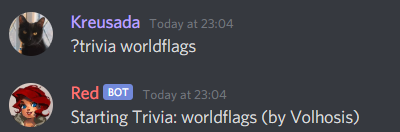

.. _guide_trivia_list_creation:

==========================
Trivia List Creation Guide
==========================

The Trivia cog allows you to create your own "trivia lists", 
which are then processed in the cog - allowing you to create as
many questions as you'd like, with easy to use syntax.

---------------
Getting Started
---------------

Let's start off by creating a file named ``mytrivia.yaml``.
Our trivia list will be named after the file, so in this case,
it will be called ``mytrivia``.

------------
Author Field
------------

We should first include an ``AUTHOR`` field,
to let the user know who wrote the questions.

When the user starts the trivia, the author(s) will
be sent in the starting message (see below).

The following should be placed at the top of your file, replacing "Red" 
with your name:

.. code-block:: yaml

    AUTHOR: Red

If there are multiple authors, we can separate them with commas.

.. code-block:: yaml

    AUTHOR: Red, Rojo, Rouge

---------------------
Questions and Answers
---------------------

Writing questions and answers is simple. Once you've finished your
``AUTHOR`` field, you can move on to your questions just below.

Questions should consist of at least one answer, with other
possible answers included if necessary. You must put a colon at the end 
of the question, for example:

.. code-block:: yaml

    How many days are there in a regular year?:

Answers will follow below, each separated by a line break and with a
hyphen at the start of the line.

.. code-block:: yaml

    How many days are there in a regular year?:
    - 365
    - three hundred and sixty five

It's always nice to include alternative answers if a question needs it. 
We can add as many valid answers as we'd like below this question. Answers
are **NOT** case sensitive, so you don't need to worry about adding the same
answer multiple times in different casings.

There are multiple special characters in YAML, such as colons, hashtags, hyphens
and more. If these characters are included within our questions or answers,
you'll need to enclose the content with quotation marks.

.. code-block:: yaml

    "Who is the #1 followed user on Twitter?":

If we didn't have these quotation marks, the question would not render.

.. code-block:: yaml

    Who is the #1 followed user on Twitter?:

.. tip::

    We can also include line breaks within our questions by using ``\n``, like
    this for example:

    .. code-block:: yaml 

        "My first line\nMy second line":

As you've added more questions, your file should look something like this:

.. code-block:: yaml

    AUTHOR: Red
    How many days are there in a regular year?:
    - 365
    - three hundred and sixty five
    "Who is the #1 followed user on Twitter?":
    - Barack Obama
    - Obama
    What is the only sea without any coasts?:
    - Sargasso
    - Sargasso Sea
    Who won the Premier League in 2015?:
    - Chelsea
    - chelsea f.c.
    How much money is a US Olympic gold medalist awarded?:
    - $25,000
    - 25,000
    - 25k
    - 25000
    - $25000

You can keep adding questions until you are satisfied, and then you can upload and
play your very own trivia! See :ref:`[p]triviaset custom <trivia-command-triviaset-custom>` for more information.

Still stuck? Take a look at 
`the core trivia lists <https://github.com/Cog-Creators/Red-DiscordBot/tree/V3/develop/redbot/cogs/trivia/data/lists>`_
for reference.
